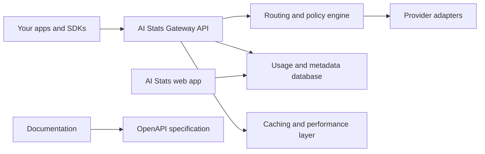

<div align="center">
  
  <h1>AI Stats</h1>
  <p><strong>Unified AI gateway and model intelligence platform.</strong></p>

  <p>
    <a href="https://ai-stats.phaseo.app">Website</a>
    &middot;
    <a href="https://docs.ai-stats.phaseo.app">Docs</a>
    &middot;
    <a href="https://github.com/AI-Stats/AI-Stats/issues">Issues</a>
    &middot;
    <a href="https://discord.gg/aQyywCvgZ5">Discord</a>
  </p>

  <p>
    <a href="https://github.com/AI-Stats/AI-Stats/actions/workflows/ci.yml"></a>
    <a href="./LICENSE"></a>
    <a href="https://securityscorecards.dev/viewer/?uri=github.com/AI-Stats/AI-Stats"></a>
  </p>
</div>

<p align="center">
  <code>pnpm add @ai-stats/sdk</code>
  &nbsp;&nbsp;|&nbsp;&nbsp;
  <code>pip install ai-stats-py-sdk</code>
</p>

<p align="center">
  100+ models across 10+ providers on the API today.
</p>

<p align="center">
  Use AI Stats as both a unified gateway API and a model intelligence database to compare real-world model performance.
</p>

<p align="center">
  
</p>

---

## Why AI Stats

- Route requests with policy-aware failover and provider selection.
- Use OpenAI-compatible endpoints plus gateway-specific controls.
- Track telemetry, spend, and reliability in one place.
- Compare model and provider performance across a broad database of benchmark and usage data.
- Build on a transparent OSS stack with security-first defaults.

## Platform coverage

| Surface                                       | Status      | Notes                                                                   |
| --------------------------------------------- | ----------- | ----------------------------------------------------------------------- |
| REST API                                      | Available   | Unified gateway endpoints with OpenAI-compatible request patterns.      |
| TypeScript SDK (`@ai-stats/sdk`)              | Available   | First-party SDK for TS/JS apps and services.                            |
| Python SDK (`ai-stats-py-sdk`)                | Available   | First-party Python SDK for backend and data workflows.                  |
| Model database + comparisons                  | Available   | Explore benchmark, usage, and provider-level performance across models. |
| Other SDK languages (Go, C#, PHP, Ruby, more) | In progress | Generated SDKs and language support are actively expanding.             |
| Web dashboard + docs                          | Available   | Routing controls, usage visibility, and integration documentation.      |

## Endpoint coverage

| Endpoint               | Status         | Notes                                                        |
| ---------------------- | -------------- | ------------------------------------------------------------ |
| `/v1/responses`        | Available      | Primary unified endpoint for most generation workflows.      |
| `/v1/chat/completions` | Available      | OpenAI-compatible chat completions support.                  |
| `/v1/messages`         | Available      | Anthropic Messages-compatible support.                       |
| `/v1/embeddings`       | Available      | Vector embedding generation.                                 |
| `/v1/moderations`      | Available      | Safety and moderation scoring.                               |
| Image generation       | Roadmap (ASAP) | Priority rollout with unified input/output behavior.         |
| Audio generation       | Roadmap (ASAP) | Priority rollout for speech and related audio outputs.       |
| Video generation       | Roadmap (ASAP) | Priority rollout for async and long-running generation jobs. |
| Music generation       | Roadmap (ASAP) | Priority rollout as part of multimodal expansion.            |

## Quickstart

### 1. Create a free account

Sign up at `https://ai-stats.phaseo.app` and create your first API key from the dashboard.

### 2. Add credits or start with free models

Top up credits in the dashboard, or start immediately with one of the free-supported models.

### 3. Make your first request

Use the Playground in the web app, or call the API from your app with `@ai-stats/sdk`, `ai-stats-py-sdk`, or direct HTTP.

### 4. Build anywhere

Integrate AI Stats in any stack where you can make HTTP requests.  
Our goal is to make AI as easy as possible to get running across many models and providers.

## Repository layout

- `apps/web`: Next.js web app.
- `apps/api`: Hono + Cloudflare Workers gateway.
- `apps/docs`: Mintlify docs.
- `packages/sdk/*`: All SDK implementations for the platform (TypeScript, Python, and other language SDKs).
- `packages/sdk/sdk-ts`: TypeScript SDK package (`@ai-stats/sdk`).
- `packages/sdk/sdk-py`: Python SDK package (`ai-stats-py-sdk`).

## How it works



## Usage examples

### Next.js / Node (OpenAI-compatible)

```ts
import OpenAI from "openai";

const client = new OpenAI({
	apiKey: process.env.AI_STATS_API_KEY,
	baseURL: "https://api.phaseo.app/v1",
});

const result = await client.chat.completions.create({
	model: "gpt-5-nano-2025-08-07",
	messages: [
		{ role: "user", content: "Summarize AI Stats in one sentence." },
	],
});

console.log(result.choices[0]?.message?.content);
```

### Python

```python
import requests

response = requests.post(
    "https://api.phaseo.app/v1/responses",
    headers={
        "Authorization": "Bearer YOUR_API_KEY",
        "Content-Type": "application/json",
    },
    json={
        "model": "gpt-5-nano-2025-08-07",
        "messages": [{"role": "user", "content": "Hello from Python."}],
    },
    timeout=60,
)
print(response.json())
```

### curl

```bash
curl https://api.phaseo.app/v1/chat/completions \
  -H "Authorization: Bearer $AI_STATS_API_KEY" \
  -H "Content-Type: application/json" \
  -d '{
    "model": "gpt-5-nano-2025-08-07",
    "messages": [{"role":"user","content":"Hello from curl."}]
  }'
```

## Resources

- API and developer docs: `https://docs.ai-stats.phaseo.app`
- Contribution guide: `./CONTRIBUTING.md`
- Code of Conduct: `./CODE_OF_CONDUCT.md`
- Security policy: `./SECURITY.md`
- [Good First Issues](https://github.com/AI-Stats/AI-Stats/issues?q=is%3Aissue+is%3Aopen+label%3A%22good+first+issue%22)

## Contributing

We actively welcome contributions across web, API, docs, data quality, SDKs, and tooling.

Every contribution is reviewed before merge, and we encourage both first-time and experienced contributors to get involved.

Please review `./CONTRIBUTING.md` and `./CODE_OF_CONDUCT.md` before opening a PR.

## Security

Please report vulnerabilities privately via GitHub Security Advisories (preferred) or `security@phaseo.app`.

## Roadmap

- **Multimodal coverage (ASAP):** ship unified image, audio, video, and music generation support with consistent request/response behavior.
- **Provider expansion:** continue growing provider coverage and compatibility depth while improving failover quality.
- **Routing intelligence:** improve latency/throughput/cost-aware routing controls and observability for production workloads.
- **SDK and docs parity:** keep SDKs and documentation tightly aligned with gateway capabilities and release cadence.
- **Developer workflow:** keep making API onboarding, playground testing, and migration from other platforms simpler.
- **Community-built roadmap:** prioritize features with community input and contributor PRs.

## License

- Core apps (`apps/web`, `apps/api`, `apps/docs`) are AGPL-3.0.
- SDKs under `packages/sdk/*` are MIT.
- Full terms: `./LICENSE`.
