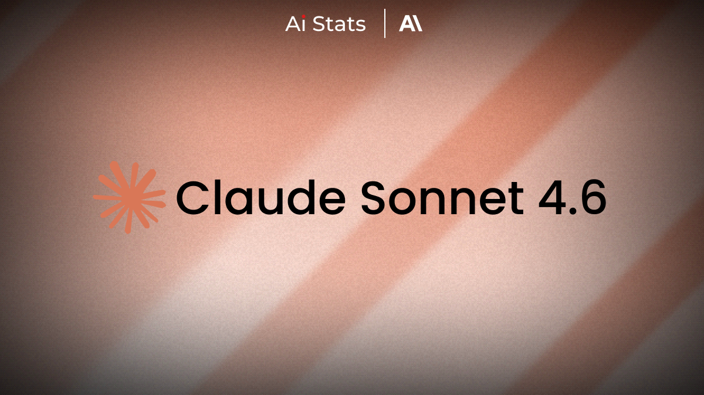

<Update label="18th February 2026">
# Model Additions

We introduced the following new model:

### Anthropic

- [Claude Sonnet 4.6](https://ai-stats.phaseo.app/models/anthropic/claude-sonnet-4-6-2026-02-17)

# Database Updates

Added and aligned metadata/pricing support for Claude Sonnet 4.6 across tracked provider surfaces.

</Update>

<Update label="30th January 2026">
# Model Additions

Introduced multiple models that were missing or released:

### Z AI

- [GLM 4.5 Air X](https://ai-stats.phaseo.app/models/z-ai/glm-4-5-air-x)
- [GLM 4.5 X](https://ai-stats.phaseo.app/models/z-ai/glm-4-5-x)

### xAI

- [Grok Imagine Image](https://ai-stats.phaseo.app/models/x-ai/grok-imagine-image-2026-01-29)
- [Grok Imagine Video](https://ai-stats.phaseo.app/models/x-ai/grok-imagine-video-2026-01-29)

### Qwen

- [Qwen 3 Max Thinking](https://ai-stats.phaseo.app/models/qwen/qwen-3-max-thinking-2026-01-26)

### Moonshot AI

- [Kimi K2.5](https://ai-stats.phaseo.app/models/moonshot-ai/kimi-k2-5-2026-01-27)

### MiniMax

- [MiniMax M2 Her](https://ai-stats.phaseo.app/models/minimax/minimax-m2-her-2026-01-24)

# Database Updates

Multiple models have had pricing added, we aim to keep this up to date as possible, however, please let us know of any changes that we might miss.

</Update>

<Update label="19th January 2026">
# Model Additions

We added multiple new models from Aion Labs, Arcee, Black Forest Labs, ByteDance, Google, Liquid AI, Nous, Z.AI. You can view all changes on the monitor: [Datbase Monitor](https://ai-stats.phaseo.app/monitor).

# Database Updates

Many other parts of the database have been updated to support our Gateway.

</Update>

<Update label="3rd January 2026">
# Organisation Additions

We are excited to welcome the following new organisations to our database:

- [Relace](https://ai-stats.phaseo.app/organisations/relace)
- [Arcee AI](https://ai-stats.phaseo.app/organisations/arcee-ai)
- [Liquid AI](https://ai-stats.phaseo.app/organisations/liquid-ai)
- [Sourceful](https://ai-stats.phaseo.app/organisations/sourceful)
- [Prime Intellect](https://ai-stats.phaseo.app/organisations/prime-intellect)
- [Naver HyperClova](https://ai-stats.phaseo.app/organisations/naver-hyperclova)

# Model Additions

We added the following new models:

### MiniMax

- [Music 2.0](https://ai-stats.phaseo.app/models/minimax/music-2-0-2025-10-29)
- [Speech 2.6](https://ai-stats.phaseo.app/models/minimax/speech-2-6-2025-10-29)

### Z AI

- [GLM 4.7](https://ai-stats.phaseo.app/models/z-ai/glm-4-7-2025-12-22)

### ByteDance

- [Seed 1.6](https://ai-stats.phaseo.app/models/bytedance/seed-1-6)
- [Seed 1.6 Flash](https://ai-stats.phaseo.app/models/bytedance/seed-1-6-flash)
- [Seed 1.8](https://ai-stats.phaseo.app/models/bytedance/seed-1-8-2025-12-18)
- [Seedream 4.5](https://ai-stats.phaseo.app/models/bytedance/seedream-4-5)

### Relace

- [Relace Search](https://ai-stats.phaseo.app/models/relace/relace-search)

### Arcee AI

- [Trinity Large](https://ai-stats.phaseo.app/models/arcee-ai/trinity-large)

We also added many more models and made adjustments to existing models.

# API Provider Additions

We added the following new providers:

- [Moonshot AI Turbo](https://ai-stats.phaseo.app/api-providers/moonshotaiturbo)
- [Nebius Token Factory](https://ai-stats.phaseo.app/api-providers/nebiustokenfactory)
- [Crusoe](https://ai-stats.phaseo.app/api-providers/crusoe)
- [Liquid](https://ai-stats.phaseo.app/api-providers/liquid)
- [Mancer](https://ai-stats.phaseo.app/api-providers/mancer)
- [Relace](https://ai-stats.phaseo.app/api-providers/relace)
- [Xiaomi](https://ai-stats.phaseo.app/api-providers/xiaomi)
- [Morph](https://ai-stats.phaseo.app/api-providers/morph)
- [Phala](https://ai-stats.phaseo.app/api-providers/phala)
- [Z AI](https://ai-stats.phaseo.app/api-providers/zai)
- [Aion Labs](https://ai-stats.phaseo.app/api-providers/aionlabs)
- [Clarifai](https://ai-stats.phaseo.app/api-providers/clarifai)
- [Friendli](https://ai-stats.phaseo.app/api-providers/friendli)
- [GMI Cloud](https://ai-stats.phaseo.app/api-providers/gmicloud)
- [Fireworks](https://ai-stats.phaseo.app/api-providers/fireworks)
- [Inception](https://ai-stats.phaseo.app/api-providers/inception)
- [Sambanova](https://ai-stats.phaseo.app/api-providers/sambanova)
- [Sourceful](https://ai-stats.phaseo.app/api-providers/sourceful)
- [Atlas Cloud](https://ai-stats.phaseo.app/api-providers/atlascloud)
- [Cloudflare](https://ai-stats.phaseo.app/api-providers/cloudflare)
- [Hyperbolic](https://ai-stats.phaseo.app/api-providers/hyperbolic)
- [Infermatic](https://ai-stats.phaseo.app/api-providers/infermatic)
- [Inflection](https://ai-stats.phaseo.app/api-providers/inflection)
- [Perplexity](https://ai-stats.phaseo.app/api-providers/perplexity)
- [Featherless](https://ai-stats.phaseo.app/api-providers/featherless)
- [SiliconFlow](https://ai-stats.phaseo.app/api-providers/siliconflow)
- [ByteDance Seed](https://ai-stats.phaseo.app/api-providers/bytedanceseed)
- [Black Forest Labs](https://ai-stats.phaseo.app/api-providers/blackforestlabs)
- [MiniMax Lightning](https://ai-stats.phaseo.app/api-providers/minimaxlightning)
- [Weights & Biases](https://ai-stats.phaseo.app/api-providers/weightsandbiases)

</Update>

<Update label="31st December 2025">
# Model Additions

We added the following new model:

### LG

- [K EXAONE](https://ai-stats.phaseo.app/models/lg/k-exaone-2025-12-31)

</Update>

<Update label="29th December 2025">
# Model Additions

We added the following new models:

### Naver-HyperClova

- [HyperClova X Seed Omni 8B](https://ai-stats.phaseo.app/models/naver-hyperclova/hyperclova-x-seed-omni-8b-2025-12-29)
- [HyperClova X Seed Think 32B](https://ai-stats.phaseo.app/models/naver-hyperclova/hyperclova-x-seed-think-32b-2025-12-29)

</Update>

<Update label="23rd December 2025">
# Model Additions

We added the following new model:

### Minimax

- [MiniMax M2.1](https://ai-stats.phaseo.app/models/minimax/minimax-m2-1-2025-12-23)

</Update>

<Update label="22nd December 2025">
# Model Additions

We added the following new model:

### Z-AI

- [GLM 4.7](https://ai-stats.phaseo.app/models/z-ai/glm-4-7-2025-12-22)

</Update>

<Update label="19th December 2025">
# Model Additions

We added the following new models:

### OpenAI

- [GPT 5.2 Codex](https://ai-stats.phaseo.app/models/openai/gpt-5-2-codex-2025-12-18)

### Mistral

- [OCR 3](https://ai-stats.phaseo.app/models/mistral/ocr-3-2025-12-18)

### Z-AI

- [GLM 4.7](https://ai-stats.phaseo.app/models/z-ai/glm-4-7-2025-12-19)

# Plans Updated

We updated the Google AI and ChatGPT subscription plans. See:

- [Google AI - Free](https://ai-stats.phaseo.app/subscription-plans/google-ai-free)
- [Google AI - Pro](https://ai-stats.phaseo.app/subscription-plans/google-ai-pro)
- [Google AI - Ultra](https://ai-stats.phaseo.app/subscription-plans/google-ai-ultra)
- [ChatGPT - Free](https://ai-stats.phaseo.app/subscription-plans/chatgpt-free)
- [ChatGPT - Plus](https://ai-stats.phaseo.app/subscription-plans/chatgpt-plus)
- [ChatGPT - Pro](https://ai-stats.phaseo.app/subscription-plans/chatgpt-pro)

# Monitor Overhaul

Today we rolled out an overhaul to the Monitor experience. Changes include:

- The main monitor table has been moved into the Models page to provide a more integrated, compact and filterable way to explore models: [/models/table](https://ai-stats.phaseo.app/models/table).
- The previous [/monitor/history](https://ai-stats.phaseo.app/monitor/history) page is no longer a separate page - its timeline and insight functionality has been merged into the main [/monitor](https://ai-stats.phaseo.app/monitor) page. The /monitor page now provides an in-depth timeline and insight tool that records all database changes and gives full transparency over everything that has changed.

# Families Page

We introduced a new Families page (early work in progress) to display groups of models, which we class as families: [/families](https://ai-stats.phaseo.app/families). This view will be expanded over the coming weeks.

</Update>

<Update label="18th December 2025">
# Model Additions

We added the following new model:

### Google

- [Gemini 3 Flash Preview](https://ai-stats.phaseo.app/models/google/gemini-3-flash-preview-2025-12-17)

# Monitor & Models Page

We added a new Monitor page which shows all changes made to the database, and a tabular view on the Models page that provides a compact, filterable table of models for quick analysis.

</Update>

<Update label="17th December 2025">
# Model & Organisation Additions

## Organisation Additions

We are excited to welcome two new organisations to our database:

- [Xiaomi](https://ai-stats.phaseo.app/organisations/xiaomi) - A leading technology company expanding into AI
- [AllenAI](https://ai-stats.phaseo.app/organisations/allenai) - A research institute focused on artificial intelligence

## Model Additions

We added the following new models:

### OpenAI

- [GPT Image 1.5](https://ai-stats.phaseo.app/models/openai/gpt-image-1-5-2025-12-16)
- [ChatGPT Image Latest](https://ai-stats.phaseo.app/models/openai/chatgpt-image-latest-2025-12-16)

### Xiaomi

- [MiMo V2 Flash](https://ai-stats.phaseo.app/models/xiaomi/mimo-v2-flash-2025-12-16)

### AllenAI

- [Bolmo 1B](https://ai-stats.phaseo.app/models/allenai/bolmo-1b-2025-12-15)
- [Bolmo 7B](https://ai-stats.phaseo.app/models/allenai/bolmo-7b-2025-12-15)
- [Molmo 2 4B](https://ai-stats.phaseo.app/models/allenai/molmo-2-4b-2025-12-16)
- [Molmo 2 8B](https://ai-stats.phaseo.app/models/allenai/molmo-2-8b-2025-12-16)
- [Olmo 3.1 32B Instruct](https://ai-stats.phaseo.app/models/allenai/olmo-3-1-32b-instruct-2025-12-12)
- [Olmo 3.1 32B Think](https://ai-stats.phaseo.app/models/allenai/olmo-3-1-32b-think-2025-12-12)
- [Olmo 3 32B Think](https://ai-stats.phaseo.app/models/allenai/olmo-3-32b-think-2025-11-20)
- [Olmo 3 7B Instruct](https://ai-stats.phaseo.app/models/allenai/olmo-3-7b-instruct-2025-11-20)
- [Olmo 3 7B Think](https://ai-stats.phaseo.app/models/allenai/olmo-3-7b-think-2025-11-20)

</Update>

<Update label="15th December 2025">
# Model Additions

We added the following rumored models:

### OpenAI

- [GPT 5.2 Mini](https://ai-stats.phaseo.app/models/openai/gpt-5-2-mini-2025-12-15)
- [GPT 4o Mini TTS](https://ai-stats.phaseo.app/models/openai/gpt-4o-mini-tts-2025-12-15)
- [GPT 4o Mini Transcribe](https://ai-stats.phaseo.app/models/openai/gpt-4o-mini-transcribe-2025-12-15)
- [GPT Realtime Mini](https://ai-stats.phaseo.app/models/openai/gpt-realtime-mini-2025-12-15)
- [GPT Audio Mini](https://ai-stats.phaseo.app/models/openai/gpt-audio-mini-2025-12-15)

### Anthropic

- [Claude 4.7 Sonnet](https://ai-stats.phaseo.app/models/anthropic/claude-sonnet-4-7-2025-12-15)

# New Monitor Page

We have added a new Monitor page, consisting of two main sections: the [main monitor page](https://ai-stats.phaseo.app/monitor), which provides a more tabular, easily filterable version of the database, all compacted into a single table for quick overview and analysis; and the [history page](https://ai-stats.phaseo.app/monitor/history), which shows all the changes recorded to the database, allowing for full transparency over everything that has changed.

This is still in active development and we will take any suggestions for improvements, or changes either of the pages.

</Update>

<Update label="12th December 2025">
# Data Changes

A whole host of data changes have been made behind the scenes to improve data accuracy and consistency. We are still working on improving data coverage and accuracy, so please reach out if you spot any issues or have suggestions on how we can improve further!

We are also investigating any quicker ways to gather and update data, so if you have any ideas or suggestions, please get in touch!

# Model Additions

We added the following new models:

### OpenAI

- [GPT 5.2](https://ai-stats.phaseo.app/models/openai/gpt-5-2-2025-12-11)
- [GPT 5.2 Chat](https://ai-stats.phaseo.app/models/openai/gpt-5-2-chat-2025-12-11)
- [GPT 5.2 Pro](https://ai-stats.phaseo.app/models/openai/gpt-5-2-pro-2025-12-11)
- [GPT 5.2 Mini](https://ai-stats.phaseo.app/models/openai/gpt-5-2-mini-2025-12-11)

### Cohere

- [Rerank V4 Pro](https://ai-stats.phaseo.app/models/cohere/rerank-v4-0-pro-2025-12-11)
- [Rerank V4 Fast](https://ai-stats.phaseo.app/models/cohere/rerank-v4-0-fast-2025-12-11)

</Update>

<Update label="10th December 2025">
# Model Additions

We added the following new model:

### Qwen

- [Qwen 3 Omni Flash](https://ai-stats.phaseo.app/models/qwen/qwen-3-omni-flash-2025-12-08)

</Update>

<Update label="9th December 2025">
# Model Additions

We added the following new models:

### Mistral

- [Devstral 2](https://ai-stats.phaseo.app/models/mistral/devstral-2-2025-12-09)
- [Devstral Small 2](https://ai-stats.phaseo.app/models/mistral/devstral-small-2-2025-12-09)

### Nomos

- [Nomos 1](https://ai-stats.phaseo.app/models/nomos/nomos-1-2025-12-09)

</Update>

<Update label="8th December 2025">
# Model Additions

We added the following new models:

### Essential AI

- [Essential AI Rnj-1](https://ai-stats.phaseo.app/models/essential-ai/rnj-1-2025-12-06)

### Nous

- [Nous Research Hermes 4.3](https://ai-stats.phaseo.app/models/nous/hermes-4-3-36b-2025-12-03)

### AI21

- [Jamba Reasoning 3B](https://ai-stats.phaseo.app/models/ai21/jamba-reasoning-3b-2025-10-08)
- [GLM 4.6V](https://ai-stats.phaseo.app/models/ai21/glm-4-6v-2025-12-08)
- [GLM 4.6V Flash](https://ai-stats.phaseo.app/models/ai21/glm-4-6v-flash-2025-12-08)
- [Qwen 3 TTS](https://ai-stats.phaseo.app/models/qwen/qwen-3-tts-2025-12-05)
- [Gemini 3 Flash Image](https://ai-stats.phaseo.app/models/google/gemini-3-flash-image-2025-12-08)

# Model Updates

We added a provisional release date of December 9, 2025 for GPT 5.2 based on recent rumours ([source](https://www.theverge.com/report/838857/openai-gpt-5-2-release-date-code-red-google-response)).

Updated statuses for many models.

We added an automated status changer based on dates which runs nightly.

</Update>

<Update label="5th December 2025">
# Model Additions

We added the following rumoured models:

- Grok 4.2
- GPT 5.2

</Update>

<Update label="2nd December 2025">
# Model Additions

We added new models from Mistral and Amazon:

**Mistral:**

- [Mistral Large 3 675B](https://ai-stats.phaseo.app/models/mistral/mistral-large-3-675b-2025-12-02)
- [Ministral 3 14B](https://ai-stats.phaseo.app/models/mistral/ministral-3-14b-2025-12-02)
- [Ministral 3 8B](https://ai-stats.phaseo.app/models/mistral/ministral-3-8b-2025-12-02)
- [Ministral 3 3B](https://ai-stats.phaseo.app/models/mistral/ministral-3-3b-2025-12-02)

**Amazon:**

- [Nova 2 Lite](https://ai-stats.phaseo.app/models/amazon/nova-2-lite-2025-12-02)
- [Nova 2 Pro](https://ai-stats.phaseo.app/models/amazon/nova-2-pro-2025-12-02)
- [Nova 2 Sonic](https://ai-stats.phaseo.app/models/amazon/nova-2-sonic-2025-12-02)
- [Nova 2 Omni](https://ai-stats.phaseo.app/models/amazon/nova-2-omni-2025-12-02)
- [Nova Multimodal Embeddings](https://ai-stats.phaseo.app/models/amazon/nova-multimodal-embeddings-2025-12-02)

</Update>

<Update label="1st December 2025">
# DeepSeek Model Additions

We added the following DeepSeek models:

- [Deepseek V3.2 Speciale](https://ai-stats.phaseo.app/models/deepseek/deepseek-v3-2-speciale-2025-12-01)
- [DeepSeek V3.2](https://ai-stats.phaseo.app/models/deepseek/deepseek-v3-2-2025-12-01)

</Update>

<Update label="1st December 2025">
# Introducing The New AI Stats

## Data coverage

At the heart of AI Stats is our database. It is designed to be a highly expansive and flexible store of model data. If you have used AI Stats before, you may know we only used to have text-based models. However, we always wanted to change that, so today we are announcing that we have grown our entire data coverage dramatically to allow us to track more models, such as image, video, and embedding models, in as much detail as possible.

There is still a long road to capture every organisation, model, and benchmark result. We currently sit at ~30% coverage, but we are prioritising expanding this as quickly as possible and aim to reach at least 60% over the next year. We want our database to be the gold standard, whilst still keeping it open source so anyone can contribute. We always welcome contributions to help us get there faster!

### Model Availability

With the introduction of the AI Stats Gateway, we have also reworked how we track model availability. A full subscription plan section now allows you to see all the subscription plans we track, the models they include, and the features they offer, as well as clearly seeing the price. We have also adjusted how we display availability to make it clearer and easier to see where models are available. We plan to continue tweaking this section to make it as useful as possible.

## Data Overhaul

We have revisited what data we store, how we store it, and how we present that data, so we have built a smoother, more reliable experience across every page. It is not perfect yet, and we have plenty of optimisations ahead. We are working hard to adjust certain pages to make them clearer and easier to use. We know there is more to do, and we plan to make trends easier to track, comparisons easier to make, and data more accessible. If you have any feedback on how we can improve – whether that is certain pages and their designs or layouts, or even tracking new data points – please reach out!

</Update>
